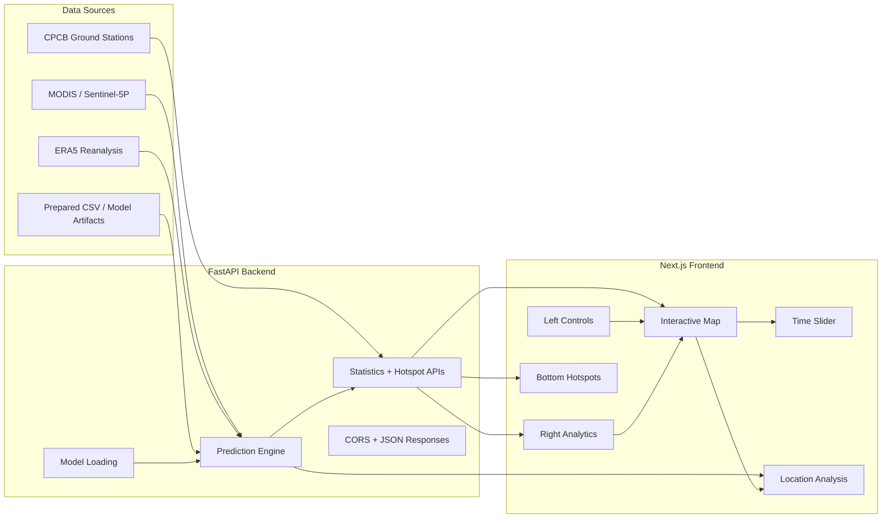

# ISRO AQI Monitoring System

AI-powered nationwide PM2.5 and AQI monitoring for India, combining satellite data, meteorological inputs, ground stations, a Python FastAPI backend, and a Next.js dashboard.

## Project Overview

| Item | Details |
| --- | --- |
| Purpose | Monitor and visualize AQI and PM2.5 across India |
| Frontend | Next.js + React dashboard |
| Backend | FastAPI prediction and analytics service |
| Data Inputs | Satellite observations, ERA5 meteorology, CPCB stations |
| Core Output | AQI maps, hotspots, national statistics, location analysis |
| Primary Docs | [Project Overview](docs/PROJECT_OVERVIEW.md), [Quick Start](docs/quick-start.md), [Setup Guide](docs/setup-guide.md), [Feature Overview](docs/feature-overview.md) |

## Architecture



## What the system does

- Renders an interactive India-wide AQI dashboard.
- Predicts PM2.5 and AQI from spatial and temporal inputs.
- Shows national statistics, hotspots, and category distribution.
- Lets users click any location for local analysis and explainability.
- Supports date-based exploration through a timeline slider.

## Key Features

- National AQI heatmap visualization.
- City search and quick map navigation.
- Click-to-analyze location panel.
- AQI category distribution and summary metrics.
- Top polluted regions carousel.
- Model explainability and feature importance.
- Date playback and manual timeline control.

## Project Structure

| Path | Purpose |
| --- | --- |
| `backend/` | FastAPI application, API endpoints, prediction logic |
| `website/` | Next.js frontend application |
| `data/` | Raw data, processed data, models, maps, archives |
| `scripts/` | Data prep, training, mapping, and validation scripts |
| `docs/` | Overview, setup, feature documentation, status notes |
| `tests/` | Validation and scratch test scripts |

## Folder Layout

```text
ISRO/
├── backend/
├── website/
├── data/
├── docs/
├── scripts/
├── tests/
├── START_WEBSITE.bat
├── START_WEBSITE.ps1
├── START_WEBSITE.sh
└── README.md
```

## Main Entry Points

- `backend/app.py` - FastAPI app, API routes, model/data loading, prediction logic.
- `website/src/app/page.tsx` - main dashboard composition.
- `website/src/lib/api.ts` - frontend API helper.
- `website/src/components/` - map, panels, and dashboard widgets.

## Data Flow

1. Prepared datasets and model artifacts are stored under `data/`.
2. The backend loads the model and serves AQI-related endpoints.
3. The frontend calls the backend through the API helper layer.
4. The dashboard updates the map, statistics, hotspots, and location panel.

## API Summary

| Endpoint | Purpose |
| --- | --- |
| `GET /api/stations` | CPCB station list |
| `GET /api/cities` | Cities with available data |
| `GET /api/predict?lat=&lng=` | PM2.5 and AQI prediction |
| `GET /api/hotspots` | Top pollution hotspots |
| `GET /api/statistics` | National summary statistics |
| `GET /api/time-series` | Historical trends |
| `GET /api/available-dates` | Timeline dates |
| `GET /api/feature-importance` | Explainability data |
| `GET /api/methodology` | Research pipeline summary |
| `GET /api/model-performance` | Validation metrics |

## Technology Stack

- Frontend: Next.js, React, TypeScript, Tailwind CSS, Leaflet.
- Backend: FastAPI, Python, Pandas, NumPy, Uvicorn.
- Modeling: XGBoost / trained model artifacts with supporting feature pipelines.
- Data: MODIS, Sentinel-5P, ERA5, CPCB station data.

## Quick Start

For the fastest launch path, use the documented startup scripts:

1. Windows: run `START_WEBSITE.bat` or `START_WEBSITE.ps1`.
2. Linux / macOS: run `START_WEBSITE.sh`.
3. Then open `http://localhost:3000`.

If you want the full manual setup, use [docs/setup-guide.md](docs/setup-guide.md).

## Manual Run

### Backend

```bash
cd backend
pip install -r requirements.txt
python -m uvicorn app:app --reload --host 0.0.0.0 --port 8000
```

### Frontend

```bash
cd website
npm install
npm run dev
```

Then open:

- Frontend: http://localhost:3000
- Backend: http://localhost:8000
- API Docs: http://localhost:8000/docs
- Health Check: http://localhost:8000/health

## Scripts

The utility scripts are grouped by purpose:

- `scripts/data_prep/` - dataset combination, extraction, geocoding, and coordinate merging.
- `scripts/training/` - baseline, refined, tuning, and ensemble training.
- `scripts/mapping/` - grid building, AQI map generation, and model application.
- `scripts/validation/` - dataset integrity and station merge checks.

## Documentation

- [docs/PROJECT_OVERVIEW.md](docs/PROJECT_OVERVIEW.md) - architecture and repository map.
- [docs/feature-overview.md](docs/feature-overview.md) - dashboard behavior and user-facing features.
- [docs/quick-start.md](docs/quick-start.md) - fast launch instructions.
- [docs/setup-guide.md](docs/setup-guide.md) - full installation and troubleshooting guide.

## Notes on Repository Layout

- Older top-level names such as `archive/`, `backup/`, `output/`, `output2/`, `final/`, and `maps/` are kept for compatibility, but the canonical layout now lives under `data/`.
- Generated files, caches, and machine-specific artifacts are excluded through the root `.gitignore`.

## Maintenance Tips

- Update this README whenever endpoint names, startup commands, or the dashboard layout changes.
- Keep new generated datasets and model outputs inside ignored or documented data folders.
- If you change backend data paths, update `backend/app.py` and the docs together.

## License

No license has been specified in this repository yet.
