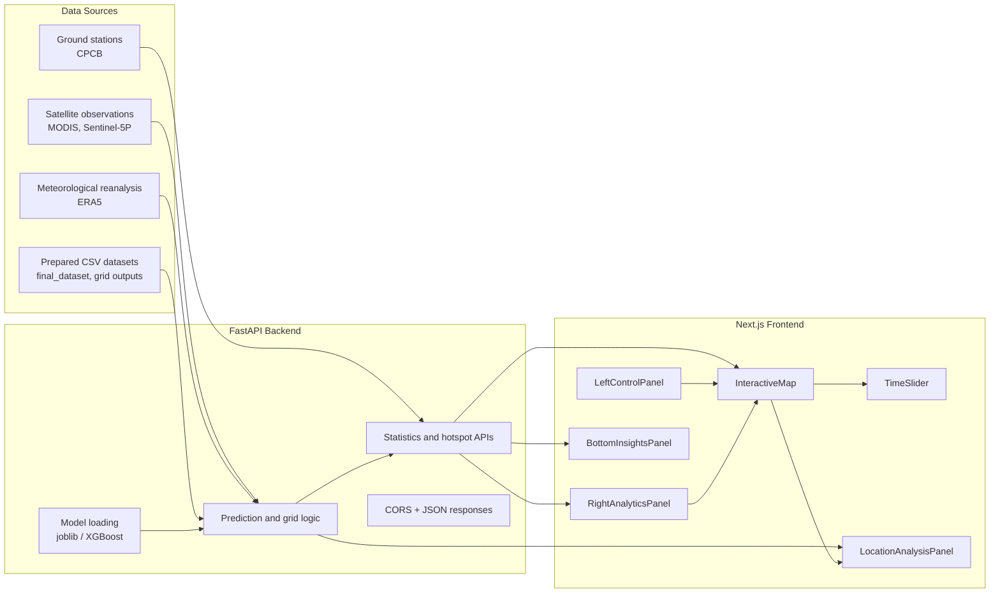

# ISRO AQI Monitoring System - Project Overview

This repository contains an AI-powered air quality monitoring platform for India. It combines a Python FastAPI backend, a Next.js frontend, and a data/model pipeline that produces AQI and PM2.5 predictions from satellite, meteorological, and ground-station inputs.

## What the project does

The application presents a national air-quality dashboard with:

- an interactive India map
- a time slider for date-based exploration
- a left control panel for cities and layer toggles
- a right analytics panel for national statistics and distribution views
- a bottom hotspot panel for the most polluted regions
- a location analysis panel that appears when the user clicks the map

The backend exposes API endpoints that the frontend uses to fetch station data, predictions, statistics, hotspots, and explainability information.

## High-level architecture



## Data flow

1. The backend reads model artifacts and prepared datasets from the repository.
2. Request handlers combine station, grid, and model outputs into JSON responses.
3. The frontend calls those endpoints through `website/src/lib/api.ts`.
4. The dashboard updates the map, panels, and timeline from the returned data.

## Backend structure

Main entry point:

- `backend/app.py` - FastAPI application, CORS setup, model/data paths, regional winter scaling rules, and the API layer.

The backend is responsible for:

- loading or serving model predictions
- reading station, grid, and historical data
- computing AQI-related outputs
- exposing endpoints for the frontend dashboard
- returning health, statistics, and methodology information

## Frontend structure

Main entry point:

- `website/src/app/page.tsx` - top-level dashboard composition

Supporting files:

- `website/src/app/layout.tsx` - root HTML shell and metadata
- `website/src/app/globals.css` - global styling tokens and base theme
- `website/src/app/providers.tsx` - application providers
- `website/src/lib/api.ts` - lightweight fetch helper for backend calls
- `website/src/components/` - dashboard panels and map widgets

## Script organization

The workspace now separates reusable scripts into purpose-named folders:

- `scripts/data_prep/combine_datasets.py` - merges satellite and ground-station datasets
- `scripts/data_prep/extract_station_data.py` - extracts station-aligned satellite and ERA5 data
- `scripts/data_prep/geocode_station_coordinates.py` - geocodes station addresses into latitude and longitude
- `scripts/data_prep/merge_station_coordinates.py` - merges the main station list with coordinate data
- `scripts/validation/print_training_medians.py` - prints feature medians from the training set
- `scripts/validation/count_capped_grid_points.py` - checks the number of capped AQI predictions
- `scripts/validation/verify_station_merges.py` - checks station-coordinate overlap
- `scripts/validation/verify_dataset_integrity.py` - checks dataset station coverage
- `scripts/training/` - baseline, refined, tuning, and ensemble training pipelines
- `scripts/mapping/` - grid extraction, AQI conversion, and map generation utilities

The old top-level artifact names still exist as junctions for compatibility, but the actual data now lives under `data/`.

The dashboard is organized around these visible regions:

- top navigation bar
- left control panel
- central interactive map
- right analytics panel
- time slider overlay
- bottom hotspots panel
- conditional location analysis panel

## Frontend component map

- `TopNavigation.tsx` - project header and date context
- `LeftControlPanel.tsx` - city search and layer toggles
- `InteractiveMap.tsx` - map rendering and click interaction
- `TimeSlider.tsx` - date navigation and playback controls
- `LocationAnalysisPanel.tsx` - per-location AQI and PM2.5 analysis
- `RightAnalyticsPanel.tsx` - national stats and distributions
- `BottomInsightsPanel.tsx` - polluted-region ranking panel
- `LoadingScreen.tsx` - initial loading state
- `EndpointConsole.tsx` - endpoint inspection UI

## File structure summary

```text
ISRO/
├── backend/
│   ├── app.py
│   └── requirements.txt
├── website/
│   └── src/
│       ├── app/
│       ├── components/
│       ├── lib/
│       └── types/
├── data/
│   ├── archive/
│   ├── backup/
│   ├── maps/
│   ├── models/
│   ├── processed/
│   └── raw/
├── docs/
│   ├── PROJECT_OVERVIEW.md
│   ├── feature-overview.md
│   ├── quick-start.md
│   ├── setup-guide.md
│   └── status/
├── scripts/
│   ├── data_prep/
│   └── validation/
├── tests/
│   └── scratch/
├── START_WEBSITE.bat
├── START_WEBSITE.ps1
├── START_WEBSITE.sh
└── .gitignore
```

## Important directories and what they mean

- `backend/` - runtime API service
- `website/` - Next.js dashboard application
- `data/` - raw inputs, processed datasets, models, maps, backups, and archives
- `docs/` - user guides, overview, and status notes
- `scripts/` - named utility scripts grouped by purpose
- `tests/` - scratch and validation scripts

## What is ignored by Git

The root `.gitignore` now excludes:

- Python caches and virtual environments
- Node/Next.js build outputs and dependencies
- ML tool caches such as `catboost_info/`
- generated output directories such as `output/`, `output2/`, and `backup/`
- the temporary `New folder/` directory
- editor and OS noise files

## How to work with the project

1. Start the backend from `backend/`.
2. Start the frontend from `website/`.
3. Open the dashboard in the browser and use the map, timeline, and panels together.
4. Keep generated artifacts in ignored directories so the Git history stays clean.

## Notes for future maintenance

- If you create new generated datasets or training outputs, add them to `.gitignore` if they should not be versioned.
- If the backend data paths change, update `backend/app.py` and this document together.
- If the frontend component layout changes, update the file structure section so the document stays accurate.
